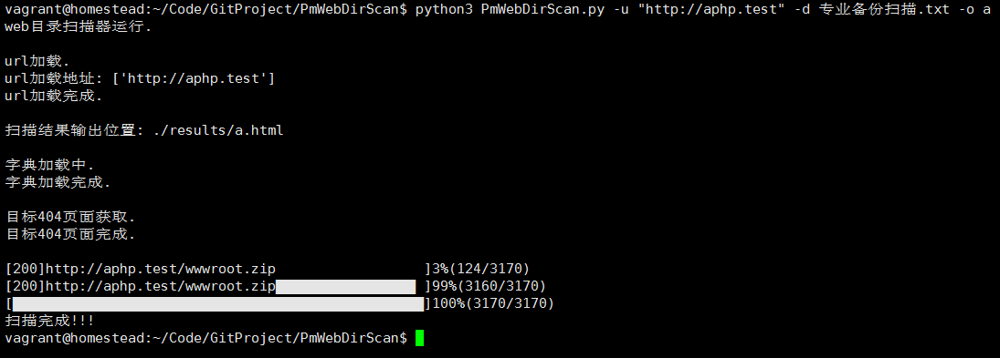
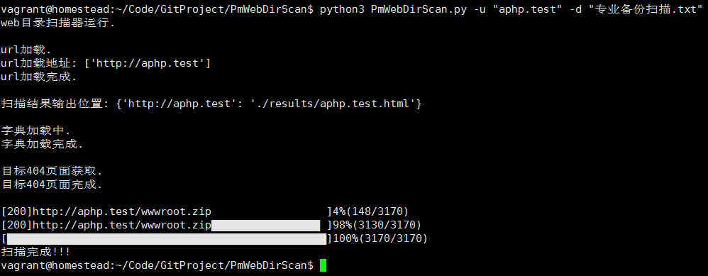

# 简介

`PmWebDirScan.py`(QAQ)我是一个可怜兮兮不知道好不好用就给强行写出来用作扫描web目录泄露的无辜扫描器. (T^T)

# 免责声明
该工具仅用于安全自查检测

由于传播、利用此工具所提供的信息而造成的任何直接或者间接的后果及损失，均由使用者本人负责，作者不为此承担任何责任。

本人拥有对此工具的修改和解释权。未经网络安全部门及相关部门允许，不得善自使用本工具进行任何攻击活动，不得以任何方式将其用于商业目的。

# 注意

字典使用的御剑的字典+自己平时保存的部分字典而成

# 使用方法
```
$ python3 PmWebDirScan.py --help

usage: PmWebDirScan.py [-h] [-u URL] [-f SCAN_FILE_URL] [-d DICT] [-o OUTPUT]
                       [-t THREAD] [--timeout TIMEOUT]
                       [--http_status_code HTTP_STATUS_CODE]

(QAQ)我是一个可怜兮兮不知道好不好用就给强行写出来用作扫描web目录泄露的无辜扫描器. (T^T)

optional arguments:
  -h, --help            show this help message and exit
  -u URL, --url URL     要扫描的url
  -f SCAN_FILE_URL, --scan_file_url SCAN_FILE_URL
                        载入要扫描的url列表txt文件(每个域名换行-文件保存至domain目录)
  -d DICT, --dict DICT  提供扫描的字典位置(多个文件请使用`,`分割)
  -o OUTPUT, --output OUTPUT
                        结果输出位置
  -t THREAD, --thread THREAD
                        运行程序的线程数量
  --timeout TIMEOUT     超时时间
  --http_status_code HTTP_STATUS_CODE
                        代表扫描成功的http状态码
```
# 使用例子

## 扫描某个域名下的备份文件

```
$ python3 PmWebDirScan.py -u "baidu.com" -d 专业备份扫描.txt
```

## 批量扫描某些域名的备份文件

```
$ python3 PmWebDirScan.py -f domain_test.txt -d 专业备份扫描.txt
```
排量扫描文件请放到`domain`目录

## 批量扫描某域名多个字典

```
$ python3 PmWebDirScan.py -u "baidu.com" -d "专业备份扫描.txt,综合目录.txt"
```
所有的字典都在`dict`目录

## 扫描结果保存

```
$ python3 PmWebDirScan.py -u "baidu.com" -d "专业备份扫描.txt,综合目录.txt" -o result_test
```
执行以后扫描结果将保持至`./results/result_test.html`

## 修改扫描线程

```
$ python3 PmWebDirScan.py -u "baidu.com" -t 100
```
线程默认是50

## 修改代表扫描成功的http状态码

```
$ python3 PmWebDirScan.py -u "baidu.com" --http_status_code "200,301,403"
```
执行以后 所有状态为 200,301,403 的请求都会认为扫描成功

## 修改程序超时时间

```
$ python3 PmWebDirScan.py -u baidu.com --timeout 5
```
修改以后URL发送超过5秒,将认为超时不存在  默认超时时间为2秒

# 运行例子





# 关于我

* Author:P喵呜-phpoop
* Team:网络尖刀s小队
* QQ:3303003493

欢迎交流 : )
